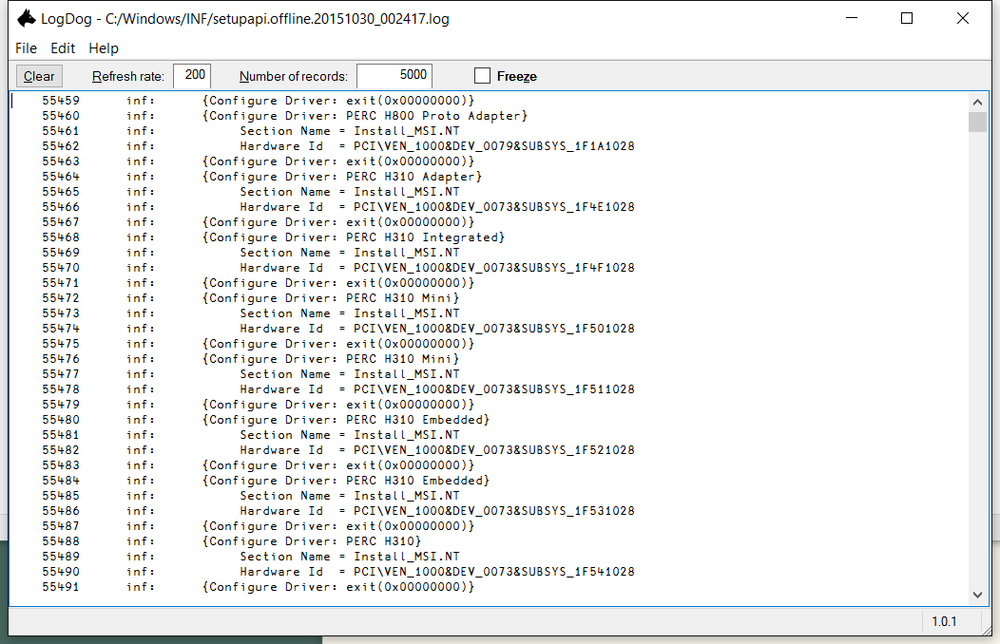

# LogDog

Windows GUI application written in Dyalog APL that allows one to watch a log file while it is changing.

## Overview

LogDog is a simple log file viewer.

It is not designed to view large log files, its purpose is rather to watch the constant changes in a log file. For that new records are automatically added to the bottom, and with auto-scrolling the latest records are always visible.

Of course you can put a stop onto the automated updates if you wish ("Freeze"), and you can also search the log file.

## Example

## Details

There are different ways in which LogDog can be used:

### Using LogDog.exe

 * You can double-click LogDog.exe and then open any log file from the "File" menu command.
 * You can drag and drop a log file onto LogDog.exe
 * You can drag and drop a log file onto LogDog.exe's GUI.
 * You can call LogDog.exe via a shortcut link or a batch file and specify a file or a folder on the command line.
 * You can select a file (or folder) from the "Recent files..." (or "Recent folders...") menu command.

Note that rather than specifying a specific log file you can also specify a folder. LogDog will then investigate the folder. If it can find files with the extension ".log" in it then it will start viewing the youngest one. If it cannot find any log files in that folder then it will start a timer and keep watching the folder.

